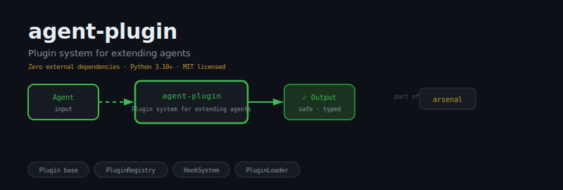
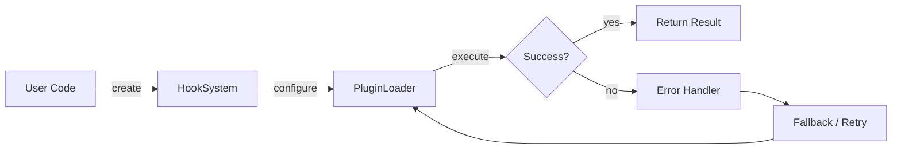
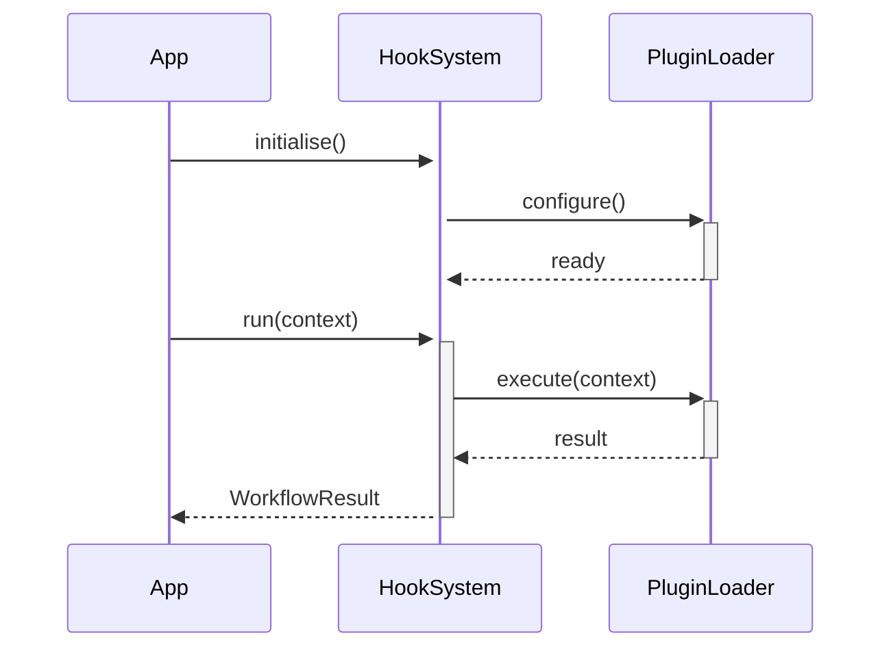

<div align="center">

</div>

# agent-plugin

**Production plugin system for extending LLM agents — pure stdlib, zero dependencies.**

[](https://pypi.org/project/agent-plugin/) [](https://python.org) [](LICENSE) [](#)

---

## The Problem

Without a plugin system, adding new capabilities requires forking the core codebase. Hot-reloading new tools, swapping implementations per environment, and isolating third-party code all require a first-class plugin architecture.

## Installation

```bash
pip install agent-plugin
```

## Quick Start

```python
from agent_plugin import HookSystem, PluginLoader, Plugin

# Initialise
instance = HookSystem(name="my_agent")

# Use
result = instance.run()
print(result)
```

## API Reference

### `HookSystem`

```python
class HookSystem:
    """Lightweight before/after hook dispatcher.
    def __init__(self) -> None:
    def register_before(self, hook_name: str, func: Callable) -> None:
        """Register *func* as a before-hook for *hook_name*.
    def register_after(self, hook_name: str, func: Callable) -> None:
        """Register *func* as an after-hook for *hook_name*.
```

### `PluginLoader`

```python
class PluginLoader:
    """Discover and load :class:`Plugin` subclasses from a directory.
    def __init__(self, plugin_dir: str) -> None:
    def discover(self) -> List[str]:
        """Return a sorted list of Python file paths that contain Plugin subclasses.
    def load_from_file(self, path: str) -> Plugin:
        """Dynamically import *path* and return the first concrete Plugin subclass instance.
```

### `Plugin`

```python
class PluginLoader:
    """Discover and load :class:`Plugin` subclasses from a directory.
    def __init__(self, plugin_dir: str) -> None:
    def discover(self) -> List[str]:
        """Return a sorted list of Python file paths that contain Plugin subclasses.
    def load_from_file(self, path: str) -> Plugin:
        """Dynamically import *path* and return the first concrete Plugin subclass instance.
```

### `MyPlugin`

```python
        class MyPlugin(Plugin):
            name = "my-plugin"
    def __init_subclass__(cls, **kwargs: object) -> None:
    def __init__(self) -> None:
    def is_active(self) -> bool:
        """Return ``True`` if the plugin has been loaded and not yet unloaded."""
    def on_load(self, context: dict) -> None:  # noqa: D401
        """Called by the registry when the plugin is loaded.
```


## How It Works

### Flow



### Sequence



## Philosophy

> *Avatāra* — divine descents — are plugins into the world; each extends the base runtime with purpose.

---

*Part of the [arsenal](https://github.com/darshjme/arsenal) — production stack for LLM agents.*

*Built by [Darshankumar Joshi](https://github.com/darshjme), Gujarat, India.*
